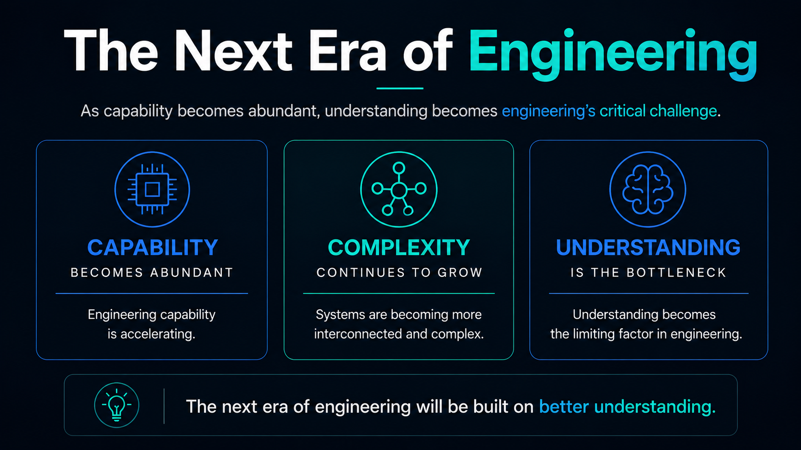
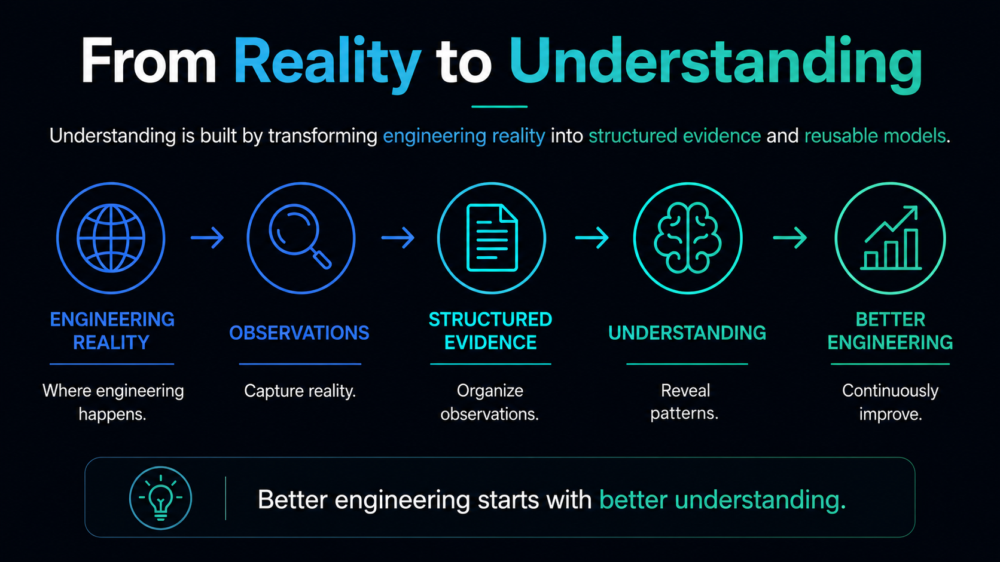
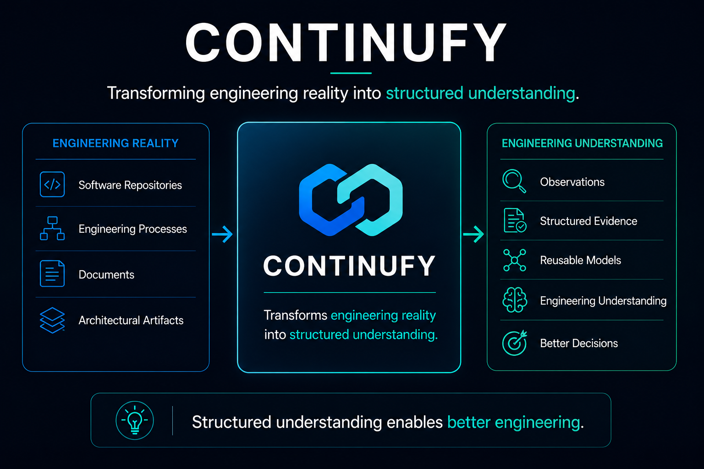

# Continufy


<p align="center">
  
</p>

Continufy is the umbrella identity for a family of independent research and engineering projects focused on software understanding, scientific instrumentation, structural analysis, and execution legitimacy.

It does not operate the projects, define their internal authority, or collapse them into one runtime. Each repository remains independently scoped and owns its own artifacts, methods, decisions, and boundaries.

## Purpose

Continufy provides a shared home for projects exploring a broader progression:

```text
Reality
        ↓
Understanding
        ↓
Evidence
        ↓
Theory
        ↓
Analysis
        ↓
Trusted Action
```

This progression is descriptive rather than executable. No artifact advances automatically, and no repository gains authority over another merely by appearing earlier in the sequence.


<p align="center">
  
</p>


## Projects

- **MindShift** — a non-operational instrument for transforming observations into transferable abstractions.
- **Research Methodology** — reusable contracts and principles for conducting rigorous research.
- **Architectural Boundary Research** — empirical investigation of recurring architectural patterns and boundaries.
- **Structology** — domain-neutral study of objects, relations, boundaries, transitions, contexts, and invariants.
- **Structural Analysis Foundations** — formal definitions, theory, and canonical research objects for structural analysis.
- **SYNAPSE** — deterministic structural analysis that transforms topology into reproducible structural evidence.
- **ContinuityOS** — legitimacy infrastructure for determining whether proposed actions are eligible to execute.

## Shared Direction

The projects share an interest in building reusable instruments rather than only producing isolated outputs.

```text
Question
        ↓
Instrument
        ↓
Artifacts
        ↓
Evidence or Models
        ↓
Review
        ↓
Improved Understanding
```

Each project specializes this pattern differently. Continufy provides the umbrella narrative, while responsibility remains local to each repository.

## Program Coordination

- [Canonical Continufy Research & Development Instrument Specification](docs/reference-execution/v1.0/canonical-instrument-specification.md) — the immutable, reusable execution contract for Reference Execution v1.0.
- [Reference Execution v1.0 coordination contract](docs/reference-execution/v1.0/coordination-contract.md) — the bounded protocol for coordinating frozen, repository-owned executions without transferring authority to Continufy.

## Boundary Principle

```text
Shared Identity
≠
Shared Authority
```

```text
Artifact Exchange
≠
Repository Control
```

```text
Umbrella
≠
Runtime
```

Continufy does not authorize research conclusions, formal theory, structural results, or execution. Those determinations remain with the repositories and review boundaries that own them.

## Core Determinations

```text
Training ≠ Instructions
Capability ≠ Cognition
Cognition ≠ Legitimacy
Proposal ≠ Authority
Capability ≠ Permission
Validation ≠ Execution
Trust ≠ Authority
Visibility ≠ Legitimacy
```

AI output is never executable by itself.

## Long-Term View


<p align="center">
  
</p>


Continufy exists to make the relationship between these projects understandable without erasing their independence.

The umbrella connects:

```text
Higher-Quality Abstractions
        ↓
More Rigorous Research
        ↓
Formal Structural Knowledge
        ↓
Deterministic Structural Evidence
        ↓
Better-Governed Engineering Systems
```

The long-term development path is:

```text
Research
        ↓
Scientific Instruments
        ↓
Validated Technologies
        ↓
Developer Platform
        ↓
Enterprise Products
```

This path is aspirational rather than automatic. Each transition depends on evidence, validation, independent review, and demonstrated value.

The value of the umbrella is coherence, not control.
