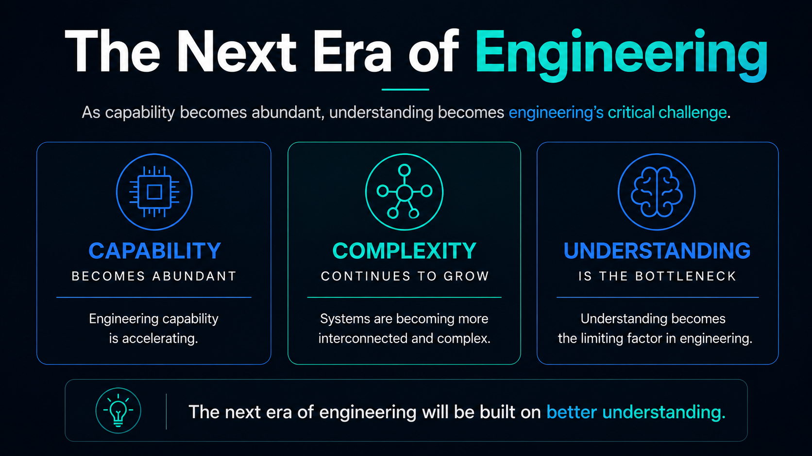
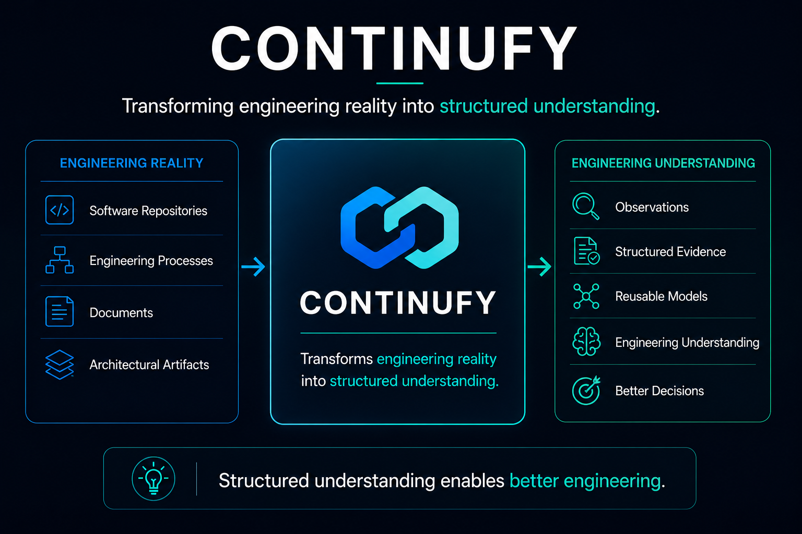

# Continufy

<p align="center">
  
</p>

Continufy is a research-and-engineering program focused on a specific systems problem:

> **How can increasingly capable autonomous systems act without allowing capability, cognition, or model output to become authority by default?**

The emerging commercial direction is **legitimate autonomous execution infrastructure**: software that can represent an exact proposed action, evaluate whether it is currently eligible to execute, enforce that boundary before side effects occur, and preserve proof of what was actually executed.

Continufy is not a single mandatory runtime or fixed pipeline. Its repositories remain independently scoped and own their own artifacts, methods, decisions, and authority boundaries. Some projects are research instruments; some are runtime technologies; some may prove unnecessary to the commercial path. Current cross-repository research is explicitly allowed to produce a sparse, nonlinear, or different topology than the one currently hypothesized.

## Core Thesis

**Intelligence is not enough.**

```text
Capability ≠ Cognition
Cognition ≠ Legitimacy
Proposal ≠ Authority
Capability ≠ Permission
Validation ≠ Execution
Trust ≠ Authority
Visibility ≠ Legitimacy
```

AI output is never executable by itself.

A system may reason well and still lack current evidence, legitimate authority, policy validity, replay safety, topology visibility, reconciliation capability, or permission to cause a real-world effect.

Continufy therefore separates:

```text
What the system can propose
        ↓
What the system is allowed to do
        ↓
What actually executes
        ↓
What can be proven afterward
```

## Commercial / Runtime Direction

The current business hypothesis is that autonomous systems need an explicit execution boundary between intent and consequential action.

```text
AI / Automation
        ↓
Exact Execution Candidate
        ↓
Authority + Policy + Current State
        ↓
Execution Eligibility
        ↓
Governed Execution Boundary
        ↓
Proof + Reconciliation
        ↓
External System
```

The commercial thesis is not that every action requires heavy governance. The boundary principle remains:

> **Conventions for the ordinary. Governance for the consequential.**

The first practical wedge is software that can answer:

> **Does this exact proposed state-changing action currently possess everything necessary to execute legitimately, exactly once, with evidence preserved?**

The main runtime work for this thesis currently lives in **ContinuityOS** and the narrower **StateGate** execution-validation surface.

## Minimal Execution Model

The candidate commercial architecture can be reduced to five primitives:

```text
1. EXECUTION CANDIDATE
Exact proposed mutation
        ↓
2. AUTHORITY
Who may permit it, with what scope and constraints
        ↓
3. ELIGIBILITY
Evaluate candidate + authority + policy + current state
        ↓
4. EXECUTION BOUNDARY
Consume only legitimate, unused eligibility
        ↓
5. PROOF + RECONCILIATION
Record what executed and whether it matched the authorized object
```

A central invariant is:

```text
validated_object == executed_object
```

A broader target is:

```text
what was evaluated
=
what was authorized
=
what was executed
=
what the proof identifies
```

These are engineering targets to be tested, not universal claims.

## Research and Technology Portfolio

The Continufy repositories do not form a mandatory production pipeline. They are better understood as a portfolio of independently testable research and technology components.

### Runtime / commercial candidates

- **ContinuityOS** — legitimacy infrastructure for execution-capable systems; evaluates whether proposed actions are eligible to execute and preserves execution/proof boundaries.
- **StateGate** — narrow deterministic validation for GitHub repository state transitions; a bounded product wedge and reference execution surface.

### Research and enabling technologies

- **MindShift** — context and cognition-governance research; studies whether structured context improves candidate cognition without creating authority.
- **Architectural Boundary Research** — empirical investigation environment for testing boundaries, methods, and cross-repository generalization.
- **Methodology Engineering** — reusable methodology and transformation-contract research.
- **Structology** — provisional domain-neutral structural model.
- **Structural Analysis Foundations** — formal mathematical research for structural analysis.
- **SYNAPSE** — deterministic structural analysis that transforms declared topology into reproducible structural evidence.

No research repository is assumed to be required for a commercial runtime merely because it exists in the ecosystem. Each component must demonstrate incremental value over native controls and simpler alternatives.

## Research Topology Is a Hypothesis

Earlier Continufy work often described a progression such as:

```text
Higher-Quality Abstractions
        ↓
More Rigorous Research
        ↓
Formal Structural Knowledge
        ↓
Deterministic Structural Evidence
        ↓
Better-Governed Engineering Systems
```

This is now treated as a **candidate research topology**, not a required architecture.

The evidence is allowed to show that:

- some components are foundational;
- some are specialized;
- some are redundant with ordinary engineering methods;
- some handoffs do not need to exist;
- some ordering assumptions are wrong;
- a simpler topology is better.

Successful integration alone is not evidence of unique value.

## Why Continufy

As AI systems become more capable, producing candidate actions becomes cheaper. The harder problem shifts toward controlling consequential effects without destroying useful autonomy.

Continufy explores that boundary through two linked but distinct programs:

```text
RESEARCH PROGRAM
What architecture actually works?
What abstractions transfer?
Which components add measurable value?

COMMERCIAL PROGRAM
How can an autonomous system be allowed to act
only when an exact action is legitimately eligible,
and how can that fact be proven afterward?
```

Research informs the runtime. Research does not automatically authorize runtime architecture, product claims, or commercialization.

## Program Coordination

- [Canonical Continufy Research & Development Instrument Specification](docs/reference-execution/v1.0/canonical-instrument-specification.md) — immutable reusable execution contract for Reference Execution v1.0.
- [Reference Execution v1.0 coordination contract](docs/reference-execution/v1.0/coordination-contract.md) — bounded protocol for coordinating frozen, repository-owned executions without transferring authority to Continufy.
- [Continufy SOP-to-Executable Governance Contract v1.0](docs/sop-governance/v1.0/contract.md) — domain-neutral, non-runtime contract separating SOP instruction, evidence, decision, authority, eligibility, exact execution, proof, outcome, and revision.

## Boundary Principles

```text
Shared Identity ≠ Shared Authority
Artifact Exchange ≠ Repository Control
Research Evidence ≠ Runtime Authority
Structural Evidence ≠ Legitimacy
Proposal ≠ Authority
Validation ≠ Execution
```

Continufy itself does not authorize research conclusions, formal theory, structural results, or external actions. Those determinations remain with the repositories, contracts, runtime boundaries, and legitimate authority owners that govern them.

## Current Development Path

The current path is intentionally evidence-gated:

```text
Research
        ↓
Bounded Experiments
        ↓
Reference Implementations
        ↓
Real Execution-Surface Evidence
        ↓
Independent Validation
        ↓
Narrow Developer Product
        ↓
Broader Platform, only if justified
```

The immediate commercial question is not whether Continufy can describe a large architecture. It is whether a minimal execution boundary can reliably prevent illegitimate effects, permit legitimate ones, execute them exactly once, and preserve useful proof with acceptable friction.

If that does not survive real execution, the architecture and business thesis should narrow or change.

## Long-Term View

<p align="center">
  
</p>

The strongest long-term hypothesis is:

> **Continufy could become infrastructure for legitimate autonomous execution.**

That outcome is not assumed. It depends on repeated evidence that the execution-boundary approach provides measurable value beyond native IAM, policy engines, CI, ordinary approval workflows, and simpler conventional controls.
